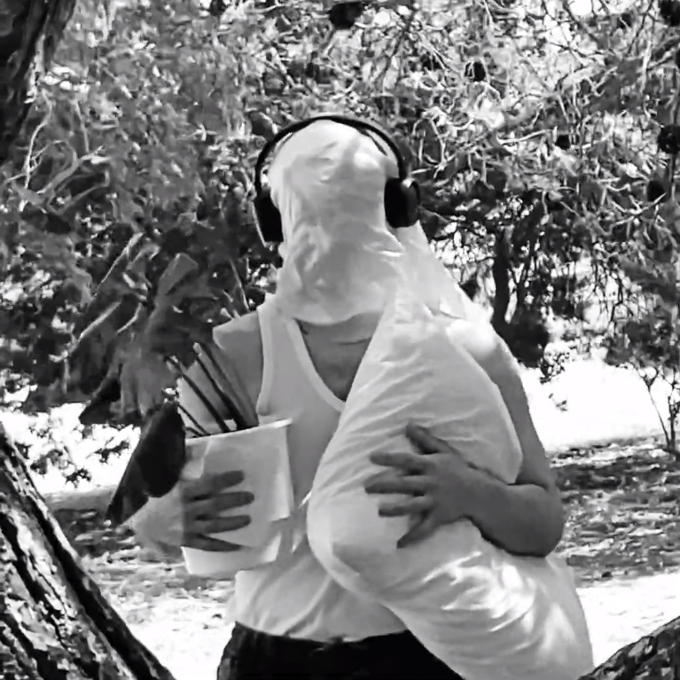

# Lesson: Digital Storytelling
# Design Document

### First and Last Name: Εύα Δόστογλου - Δημήτρης Καμπεράκης - Ευστράτιος Κουτουλακης - Ανδρέας Μπιρμπίλης
### University Registration Number: dpsd19032 - dpsd19044 - dpsd19061 - dpsd19080
### GitHub Personal Profile: [veruca](https://github.com/merkourisa/Digital-Storytelling-Group-Assignment/discussions/1#discussioncomment-5360442)

## 1. Περίληψη

--> Το θέμα της ταινίας έχει να κάνει με ένα μυστηριώδες πλάσμα που αναφύεται από την γη όταν ένα μοναχικό άτομο θάβει κρυφά ένα γράμμα μέσα στο χώμα. Θέλοντας να αποφύγει καταστάσεις και να απαλλαγεί από τα συναισθήματα και τις σκέψεις του, φυτεύει το γράμμα σε ένα σημείο που κάνεις ποτε δεν θα ανακαλύψει. Στην ιστορία παρουσιάζεται μία αγωνιώδης προσπάθεια για τον αφανισμό και την συγκάλυψη ενός πλάσματος που η κινητήρια δύναμή του δεν είναι άλλη από τον ίδιο τον Εαυτό. Το άτομο που πρωταγωνιστεί σε αυτή την περιπέτεια, θα έρθει αντιμέτωπο με ένα πλάσμα που έχουν δημιουργήσει όσα προσπαθεί να  απωθήσει.

## 2. Στόχος

--> Η ταινία έχει στόχο να αναδείξει με έναν παραστατικό τρόπο ότι όταν προσπαθούμε να κρύψουμε όσα μας απασχολούν έρχεται η στιγμή που τα ανεπίλυτα συναισθήματά μας βγαίνουν στην επιφάνεια και μας κατακλύζουν φέρνοντάς μας αντιμέτωπους με τον εαυτό μας.

## 3. Αφήγηση

--> Το κοινό βιώνει την αφήγηση σε **πρώτο** και **τρίτο** πρόσωπο. Αρχικά έχει τον ρόλο ενος αμέτοχου παρατηρητή, ακολουθεί κρυφά τον πρωταγωνιστή από απόσταση παρατηρώντας την δράση. Ξαφνικά το κοινό - κάμερα παίρνει την θέση του πρωταγωνιστή. Τέλος το κοινό επιστρέφει στην αρχική του θέση. 

--> Η αφήγηση της ιστορίας επιτυγχάνεται με **συμβολισμούς** καθώς δεν εκτυλίσσεται σε ρεαλιστικό χώρο και χρόνο.

## 4. Υπόθεση
--> Ένα μοναχικό άτομο θάβει κρυφά ένα μυστηριώδες γράμμα στο χώμα, την επόμενη μέρα στο σημείο αυτό έχει φυτρώσει ένα παράξενο φυτό με ανθρώπινα νύχια που αναδύει μία απόκοσμη ενέργεια. Η εμφάνιση αυτού του φυτού δημιουργεί πανικό στο άτομο που το καταστρέφει, νομίζοντας ότι μπορεί να απαλλαγεί για πάντα από όσα πηγάζουν από το γράμμα. Μία ύπαρξη πλασμένη από το περιεχόμενο του γράμματος γεννιέται και σταδιακά αρχίζει να απελευθερώνεται από το έδαφος, τρομοκρατώντας το άτομο και διεκδικώντας όλο και περισσότερο χώρο στην ζωή του. Όσο προσπαθεί να θάψει τα ενδόμυχα συναισθήματα και τις σκέψεις του,  οι εσωτερικοί του δαίμονες αποκτούν πνοή στο σώμα ενός πλάσματος που είναι πια αδύνατο να αγνοήσει.

## 5. Κόσμος
--> Ο κόσμος στον οποίο διαδραματίζεται η ιστορία αποτελεί ένα μίγμα του φανταστικού και του πραγματικού κόσμου, του εσωτερικού και εξωτερικού κόσμου. Ό κόσμος αυτός πρόκειται για έναν ψυχολογικό χώρο που έχει διαμορφωθεί γύρω από το πρωταγωνιστικό άτομο, ένας κόσμος που το απομονώνει, το τρομάζει και του ανήκει αποκλειστικά. 

## 6. Χαρακτήρες

--> Στην ιστορία παρουσιάζονται δύο χαρακτήρες. Αρχικά ο πρωταγωνιστής ως ανθρώπινη ύπαρξη και σε δεύτερο χρόνο ένα πλάσμα ως συναισθηματική και απόκοσμη ύπαρξη, δημιούργημα του πρωταγωνιστή.

## 7. Ακολουθία Σκηνών

+ Διάφορα πλάνα με φύση
+ Εμφάνιση τίτλου ταινίας
+ Ο πρωταγωνιστής περπατάει αργά στη φύση για λίγα λεπτά κρατώντας ένα φυτό, ένα μαξιλάρι και ένα γράμμα καλυμμένος με ένα πέπλο και φορώντας ακουστικά
+ Φτιάχνει το δωμάτιό του
+ Κρατάει το γράμμα
+ Πλάνα με φύση και πρωταγωνιστή μαζι με το γράμμα στο χέρι 
+ Γονατίζει στο έδαφος
+ Γρατζουνάει το έδαφος με τα νύχια του
+ Προσπαθεί να σκάψει
+ Βάζει το γράμμα μέσα στο μικρό τάφο
+ Θάβει (σκεπάζει) το γράμμα γεμίζοντας τον μικρό τάφο
+ Κουρασμένο, πλέον, πάει στο δωμάτιό του, ξαπλώνει, κοιμάται
+ (Κάμερα στο πρωταγωνιστη)
+ (Κάμερα να κοιτάει το έδαφος) 
+ Εμφάνιση ενός παράξενου φυτό εκεί που είχε θαφτεί το γράμμα
+ Ο πρωταγωνιστής πλησιάζει αργά το φυτό 
+ Σκύβει κοντά του
+ Από το φόβο του καταστρέφει το φυτό πατώντας το 
+ Ξαπλώνει δίπλα από τον τάφο για να τον παρατηρεί με σκοπό να μην ξανασυμβεί ότι έγινε 
+ Κοιμάται
+ (Εκεί που θάφτηκε το γράμμα και είχε φυτρώσει το φυτό) έχει ξεπροβάλλει ένα χέρι ενός πλάσματος και έχει πιάσει σφιχτά τον καρπό του χεριού του πρωταγωνιστή.
+ Ο πρωταγωνιστής καθώς ξυπνάει συνειδητοποιεί αυτό το γεγονός 
+ Τρομαγμένος σηκώνεται και τρέχει λίγο πιο πέρα 
+ Πλησιάζει ξανά και παρατηρεί πως το χέρι δεν υπάρχει, παίρνει το μαξιλάρι του και τρέχει μακριά 
+ Πηγαίνει αμέσως προς το ταφο  
+ Παρατηρεί στο μέρος που θάφτηκε το γράμμα να έχει φυτρώσει μια σπονδυλική στήλη
+ Τρέχει μακριά να πάρει μια πέτρα
+ Ο πρωταγωνιστής κοιτάει επίμονα (με θυμό → ήχος) την σπονδυλική στήλη και την καταστρέφει σε πολλά κομμάτια
+ Ξαφνικά νιώθει εξουθενωμένος και λιποθυμάει
+ Πρωταγωνιστής μένει λιπόθυμος για μερικά λεπτά 
+ Έχει ξεθαφτεί  από το έδαφος το πρόσωπο του πλάσματος (κάμερα πάνω από το πρόσωπο) 
+ Πρωταγωνιστής σηκώνεται, κοιτάει το πρόσωπο στο έδαφος (κάμερα κοιτάει πρόσωπο πρωταγωνιστή)
+ Φεύγει “τρομαγμένος”
+ Απελευθερώνεται το πλασμα (Το πλάσμα φαινεται σκεπασμένο με ένα πέπλο.)
+ Το πλάσμα σηκωνεται σιγά σιγά και το πέπλο φευγει με την κίνηση του
+ Το πλάσμα πλησιάζει τον πρωταγωνιστή 
+ Πλάσμα φτάνει τον πρωταγωνιστή (στο δωμάτιό του) 
+ Σκύβει προς το έδαφος πάνω του pov.πρωταγωνιστή
+ Ο πρωταγωνιστής ξυπνάει - βλέπει το πλάσμα - τρομάζει (γουρλώνει τα μάτια) pov.πλάσματος
+ το πλάσμα πιέζει τον λαιμό του πρωταγωνιστή τόσο δυνατά που βγάζει αίμα από το στόμα. pov.πρωταγωνιστή
+ Ο πρωταγωνιστής αντιστέκεται και προσπαθεί να σπρώξει μακριά τα χέρια του πλάσματος
+ Σταματά να αντιστέκεται γιατί έχει πεθάνει (αδράνεια + αίμα)
+ Τελική πράξη
+ Φαίνονται ενωμένοι 
+ Credits

## 8. Τοποθεσίες κινηματογράφησης / Επιλογή χώρων

--> Η κινηματογράφηση έγινε σε ένα πάρκο λίγο πιο έξω από την Ερμούπολη, προς Μάνα. Επιλέχθηκε αυτός ο χώρος επειδή υπάρχει έντονο το στοιχείο της φύσης και ταιριάζει με το θέμα της ταινίας.

## 9. Αισθητική

--> Η αισθητική μας προσέγγιση συγκλίνει με ορισμένες αξίες του γερμανικού εξπρεσιονισμού όπως τον κιαροσκούρο φωτισμό, τις σκιές και την σουρεαλιστική ατμόσφαιρα. Επιπλέον πρωταγωνιστούν γκροτέσκοι χαρακτήρες σε ένα πλαίσιο που μπορεί να θυμίζει παράξενο όνειρο (εφιάλτη). Τα "ζαλισμένα" πλάνα προσδίδουν μία απόκοσμη ή άρρωστη αίσθηση.

## 10. Moodboard ύφους της ταινίας

--> Στην εικόνα παρουσιάζεται μια σύνθεση από στοιχεία που επηρεάζουν την αισθητική εμπειρία της ταινίας.

.jpg)

## 11. Σκηνικά

--> Τα δομικά και συμβολικά στοιχεία  (βοηθητικά αντικείμενα - props) που αποτελούν το δωμάτιο του πρωταγωνιστή.  Ο χώρος που γίνεται όλη η δράση αποτελείται από το φυσικό περιβάλλον. Προσθήκη επιπλέον χώματος  (εσωτερικού χώρου) ώστε να γίνει πιο εύκολη η επεξεργασία του και η σύνδεση του με τα props. 

## 12.1 Βοηθητικά αντικείμενα

+ Πέπλο
+ Ακουστικά
+ Φυτό σε γλάστρα
+ Μαξιλάρι
+ Σπονδυλική στήλη από γύψο
+ Μαραμένο φυτό με ψεύτικα νύχια
+ Σχοινί
+ Μάσκα 
+ Πέτρα

## 12.2 Ενδυματολογία

--> Τα κοινά μορφολογικά χαρακτηριστικά των χαρακτήρων είναι η απουσία χαρακτηριστικών στο πρόσωπο με την χρήση των επιδέσμων. Οι επίδεσμοι χρησιμοποιούνται για την εξάλειψη των χαρακτηριστικων των προσώπων, ώστε να ταυτιστούν οι οντότητες που εμφανίζονται στην ιστορία καθως και για να πραγματοποιηθεί ταύτιση του κοινού με τον πρωταγωνιστή - πλάσμα. Ο πρωταγωνιστής έχει μερικές τούφες μαλλιών έξω από τον επίδεσμο ενω τα μαλλιά του πλάσματος αντικαθίστανται από ”καρφιά”. Ως επιπλέον κοινό στοιχείο λειτουργεί το πέπλο. Στο πρωταγωνιστη το πέπλο με τα ακουστικά από πάνω, προδίδει τον χαρακτήρα μιας καθημερινής ρουτίνας. Στο πλάσμα το πέπλο λειτουργεί σαν ο σάκος από τον οποίο γεννήθηκε και μόλις βγήκε ή σαν την καταστροφή του ορίου που το περιόριζε να εμφανιστεί, δηλαδή υπάρχει τεντωμένο πάνω του και έτσι όπως σηκώνεται θα βγει με αυτό και θα μείνει για λίγο πάνω του.

--> Τα χέρια το πλάσματος είναι παραμορφωμένα. Η παραμόρφωση πραγματοποιείται φορώντας συγκεκριμένα γάντια  (αριστερό χέρι με 4 δάχτυλα και δεξί με 3 δάχτυλα) εμπνευσμένα από τα “Margiela tabi gloves”. Ακόμη από τα γάντια εκτείνονται αιχμηρά νύχια. Τα γάντια και τα νύχια είναι μαύρα. Το πλάσμα φοράει σκισμένα ρούχα και χοντροκομμένα  - ογκόδες παπούτσια με σκοπό να αλλάξει η φόρμα του και να ψηλώσει.

--> Ο πρωταγωνιστής φοράει άσπρη φανέλα με τζιν παντελόνι και αρβύλες. Φοράει απλά, καθημερινά ρούχα τα οποία έχει οποιοδήποτε άτομο στην ντουλάπα του. 

## 12.3 Μουσική Ήχοι

--> Στην ταινία υπάρχει η απουσία του προφορικού λόγου με οποιοδήποτε μέσο. Οι δράσεις συμβαδίζουν με τους ήχους. Η ένταση, η απουσία και η ΄υπαρξη του ήχου εναλλάσσονται αναλόγως την εικόνα και την κατάσταση του πρωταγωνιστή - πλάσματος.  Η κορύφωση είναι στο τέλος.

--> Τραγούδια που χρησιμοποιήθηκαν - copyrights checked -
+ krovopuskanie - 01 bloodletting
+ krovopuskanie - 02 turning against the self
+ krovopuskanie - 03 psychonecrosis
+ Ήχος κανάτας που βράζει

## 13. Υπολογισμός παραγωγής + Χρηματοδότηση

--> Η χρηματοδότηση έγινε από την ίδια την ομάδα.
+ Μαύρη μπλούζα = 4.45€
+ Κάλτσες (3 ζευγάρια) = 5.99€ 
+ Γάζα * 3 = 4.50€
+ Γυψόγαζα = 0.80€
+ Χώμα = 3.00€
+ Σχοινί (2 μέτρα) = 0.80€ 
+ Βυσσινάδα (ένδειξη αίματος) = 1.82€
+ Σύνολο εξόδων = 21.36€

## 14. Προβολή / Περιβάλλον αλληλεπίδρασης

--> Η ταινία θα προβληθεί σε αίθουσα διαλέξεων του Πανεπιστημίου.

## 15. Απευθυνόμενο κοινό και ελκυστική διάσταση

--> Οι έφηβοι και οι νέοι ενήλικες είναι το κύριο απευθυνόμενο κοινό.  Το απευθυνόμενο κοινό βρίσκεται στη φάση της ζωής που αρχίζει να βιώνει τα έντονα και ανάμεικτα συναισθήματα της εφηβείας και μετά. Επίσης, μπορεί να του προκαλεί ενδιαφέρον μια βίαιη και υπερβολική εικόνα ως μια αισθητική και ασυνήθιστη σκηνή. Αρκετά άτομα αναζητούν προσωπική λύτρωση μέσω αυτού του είδους ταινιών. 

## 16. Εξοπλισμός

+ Camera: Nikon D3300 → πλάνα
+ iphone 12 mini → πλάνα
+ DaVinci Resolve → μοντάζ
+ Photoshop → σύνθεση zine
+ Εκτυπωτής για την υλοποίηση του zine 

## 17. Μέσα διανομής

--> Η ταινία είναι διαθέσιμη μέσω της πλατφόρμας του Youtube.

## 18. Zine

--> Το zine ως ένα μικρής διάστασης (Α5) βιβλίο, 14 σελίδων, περιέχει τα συμβολικά αντικείμενα που παρουσιάστηκαν στην ταινία από μια πιο κοντινή ματιά, καθω΄ς και μερικά στιγμιότυπα της. Παρακάτω παρουσιάζονται με την σειρά η κάθε σελίδα του zine.

.jpg)

.jpg)

.jpg)

.jpg)

.jpg)

## 19. Casting

--> Για το casting επιλέχθηκαν ατομα απο την ομάδα μας με βάση τον σωματότυπο που ταιριάζει καλύτερα σε κάθε χαρακτήρα.

## 20. Σκηνές

--> Στιγμιότυπα ταινίας ανεξάρτητα με την χρονολογική σειρά:

## 21. Evaluation

--> Το αποτέλεσμα ήταν ικανοποιητικό. Οι δυσκολίες που αντιμετωπίσαμε ήταν οι καιρικές συνθήκες, καθώς είχε πολύ αέρα κατα την διάρκεια των γυρισμάτων, με αποτέλεσμα να “καταστρέφονται” μερικά από τα βοηθητικά αντικείμενα. Ακόμη αντιμετωπίσαμε δυσκολία στην βιβλιοδεσία του zine.

## 22. Πηγές

+ https://krovopuskanie.bandcamp.com/album/krovopuskanie 
+ https://freesound.org/search/?q=kettle+boiling
+ https://www.dafont.com/monumental.font
