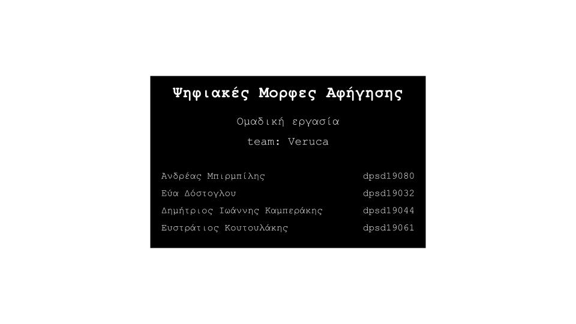

# Lesson: Digital Storytelling
# Presentation Document

### First and Last Name: xxx (all members of the team)
### University Registration Number: dpsdxxxxx (all members of the team)
### GitHub Personal Profile: xxx

.jpg)

.jpg)

.jpg)

.jpg)

.jpg)

.jpg)

.jpg)

.jpg)

.jpg)

.jpg)

.jpg)

# [Movie](https://youtu.be/zwgSVXj_yWU)
